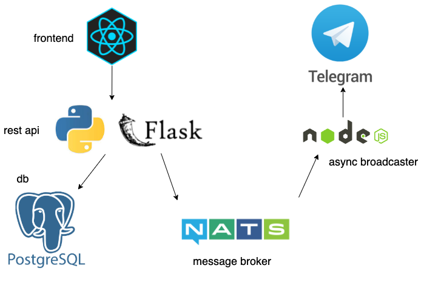

# Devops with kubernetes

## Overview



- todo-ui: frontend in React that enables adding, updating and deleting todos
- backend: exposes an API with Python & Flask for CRUD operations
- nats: message broker acting as a Pub/Sub between vote and result
- broadcaster: receives messages and broadcasts them in telegram
- telegram: displays the messages

Missing in the overview: monitoring w/ prometheus + grafana + loki.

## Notes

__Docker/Docker-compose__ \
The app can be also run with docker-compose and Nginx as a reverse proxy

__Kubernetes__ \
Creating local cluster:
```k3d cluster create -p 8081:80@loadbalancer --agents 2``` \
It is now available at `localhost:8081` \
More info about k3d + k3s: *<https://www.sokube.ch/post/k3s-k3d-k8s-a-new-perfect-match-for-dev-and-test>*

__Sealed secrets__ for private information:

- add repo: \
  ```helm repo add sealed-secrets https://bitnami-labs.github.io/sealed-secrets```
- install with: \
  ```helm install sealed-secrets --version 1.16.1 sealed-secrets/sealed-secrets``` \
    this will install it in the default namespace. Add ```--namespace <ns>``` to change ns.

- add CLI with  ```brew install kubeseal```
- run this to create a sealed secret for the broadcaster: \
```cat broadcaster-secret.yaml | kubeseal --controller-namespace default --controller-name sealed-secrets --format yaml > sealed-secret-async-broadcaster.yaml```

Some reference: *<https://www.arthurkoziel.com/encrypting-k8s-secrets-with-sealed-secrets/>*

The repo is bootstraped with Flux:
*<https://github.com/xzrm/gitops-k8s-cluster-dwk>*
